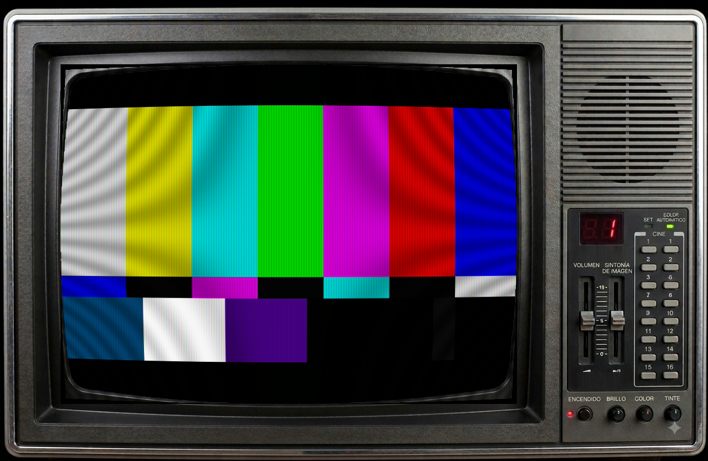

# Jellyfin CRT Marquee

*[Read this in English](README.en.md)*

### Vuelve a ver tus series como se veían de verdad.

¿Te acuerdas de plantarte frente al televisor de tubo un sábado por la mañana? Las
líneas de escaneo, el brillo fosforescente de la máscara RGB, esa leve curvatura de
pantalla que hacía que todo se viera un poquito redondeado en los bordes. Así se veían
*realmente* las series clásicas — no en el 4K plano y perfecto de un monitor moderno,
sino a través de un tubo de rayos catódicos, con todas sus imperfecciones y su encanto.

**Jellyfin CRT Marquee** le devuelve esa experiencia a tu biblioteca de Jellyfin.
Un instalador, un doble clic, y tu contenido pasa a reproducirse dentro de una TV
CRT de los 80 de cuerpo entero — marco, plástico, botones y todo — con un shader
real de emulación de tubo aplicado sobre la imagen. No es un filtro de Instagram
pegado encima: es el mismo tipo de matemática de scanlines y máscara de fósforo que
usan los emuladores de RetroArch, corriendo en vivo sobre tu reproductor de Jellyfin.

Pon una serie de los 80, apaga las luces, y vuelve a sentir que la estás viendo por
primera vez.



*(Barras de color SMPTE con el shader `crt-lottes`, generado con `mpv --vo=gpu` — ver [Pruebas](#pruebas))*

## Por qué te va a gustar

- **El marco de TV es de verdad**: tu vídeo queda insertado dentro del hueco de
  pantalla de una TV CRT de los 80 con marco, botones y carcasa — no un simple
  filtro superpuesto.
- **El efecto CRT es real, no cosmético**: curvatura de pantalla, scanlines y
  máscara de fósforo RGB calculadas en vivo por un shader GLSL, igual que en los
  emuladores retro — no un overlay de PNG semitransparente.
- **Eliges tu sabor de nostalgia**: tres shaders distintos (Lottes, Aperture,
  Hyllian), cada uno con su propia personalidad, o apágalo todo cuando quieras
  volver a lo moderno.
- **Un doble clic y listo**: sin tocar configuraciones a mano, sin editar
  `mpv.conf` tú mismo — el launcher instala, configura y abre Jellyfin por ti.

## Uso

1. Doble clic en `Jellyfin CRT Launcher.bat` (no hace falta cerrar JMP antes, el script lo hace por ti).
2. El script:
   - Cierra Jellyfin Media Player si estaba abierto.
   - Copia los shaders y la imagen del marco a la carpeta de configuración de JMP (`%LOCALAPPDATA%\jellyfinmediaplayer`).
   - Activa `useOpenGL` en `jellyfinmediaplayer.conf` (necesario, si no el vídeo se ve en pantalla negra — JMP usa ANGLE por defecto, que no soporta bien shaders multi-pasada).
   - Te deja elegir: **CRT Lottes**, **CRT Aperture**, **CRT Hyllian**, solo el marco de TV sin shader, o desactivar todo (Jellyfin normal, sin marco ni shader).
   - Abre Jellyfin Media Player automáticamente con la configuración aplicada.

Para cambiar de shader más adelante, repite el paso 1 (correr el launcher de nuevo es seguro, no duplica nada, y se encarga de cerrar/reabrir JMP).

Es portable: puedes copiar toda la carpeta a otro PC con Jellyfin Media Player instalado, no depende de ningún usuario de Windows en particular.

## Cómo funciona (resumen técnico)

- `mpv.conf` usa `--lavfi-complex` para componer el vídeo dentro del hueco de pantalla del PNG del marco (`external-file` en vez del filtro `movie=`, porque `movie=` no soporta bien rutas de Windows con letra de unidad — bug conocido de ffmpeg/mpv).
- El hueco de pantalla del PNG se detectó analizando el canal alfa (semitransparente) con un script de flood-fill: `X=36 Y=78 W=474 H=364` sobre una imagen de `670x473`.
- Cada shader GLSL fue modificado para confinar el efecto CRT (curvatura, scanlines, máscara) solo a ese rectángulo — fuera de él, el píxel pasa sin procesar, para no aplicar el efecto sobre la carcasa/plástico de la TV.
- Jellyfin Media Player **no** permite cambiar de shader en caliente con atajos de teclado: su capa de interfaz (`inputmaps/*.json`) intercepta todas las teclas antes de que lleguen a mpv. Por eso el cambio de shader se hace reinstalando/reconfigurando, no con una tecla dentro de la app.

## Pruebas

`test/test-shaders.ps1` valida que los 3 shaders compilen y rendericen bien usando
mpv standalone (`winget install --id shinchiro.mpv -e`), sin abrir Jellyfin Media
Player ni hacer clic en nada — automatiza exactamente el diagnóstico que se hizo a
mano para arreglar los bugs de `crt-aperture`/`crt-hyllian`. Ver [docs/TESTING.md](docs/TESTING.md)
para el detalle (incluye una trampa real que dio un falso positivo al principio).

```powershell
.\test\test-shaders.ps1
```

## Cómo se hizo este proyecto

Este repositorio se generó en una sesión de programación conversacional con **Claude**
(Anthropic), usando **Claude Code** (el agente CLI oficial) como herramienta.

- **Modelo**: Claude Opus 4.8 (id de modelo `claude-opus-4-8[1m]`).
- **Fecha**: 13 de agosto de 2026.
- **Commits en el repo**: 11, todos en esa misma sesión (primer commit 13:10, último
  13:38 según los timestamps de git — el trabajo real incluyó bastante más iteración
  de diagnóstico entremedio que no siempre quedó como commit).
- **Coste en tokens / precio de la sesión**: no se dispone de acceso a esa métrica
  desde dentro de la conversación, así que no se ha inventado. Si te interesa ese
  dato, puedes consultarlo desde el panel de uso/facturación de la cuenta de Claude
  que generó la sesión (no está expuesto al modelo mismo).

Notas honestas sobre el proceso, no de marketing:

- Los tres shaders CRT tuvieron **bugs reales** al adaptarlos (pantalla negra,
  luego azul, luego sin efecto) que se diagnosticaron leyendo los logs de
  compilación de shaders de mpv/Jellyfin Media Player, no adivinando. Fueron tres
  causas raíz distintas (colisión de `#define` con nombres de campos de struct,
  funciones `linearize`/`delinearize` no nativas en `vo=gpu`, doble corrección de
  gamma en la ruta de passthrough) — ver el historial de commits para el detalle
  de cada una.
- El primer intento de montar una prueba automatizada (`--vo=image`) resultó ser un
  **falso positivo**: no ejecuta el pipeline real de shaders GPU. Se detectó
  metiendo a propósito un shader roto y viendo que "pasaba" sin error. El método
  correcto (`--vo=gpu` real + captura de pantalla vía script Lua) quedó
  documentado y scripteado en [docs/TESTING.md](docs/TESTING.md) y
  `test/test-shaders.ps1`, con una autoverificación que corre ese mismo shader
  roto para confirmar que el arnés sí detecta errores antes de confiar en él.
- Las capturas de pantalla del README se generaron programáticamente (mpv
  `--vo=gpu` real + un script Lua que toma la captura y cierra), no son capturas
  manuales recortadas.

## Avisos legales

Este es un proyecto personal/hobby, sin afiliación ni respaldo de Jellyfin, mpv,
libretro/RetroArch, ni de los titulares de derechos de ningún contenido audiovisual
mostrado en las capturas.

- **Shaders** (`assets/shaders/*.glsl`): son adaptaciones/derivados de shaders CRT de
  terceros — ver la sección de créditos abajo. El repositorio de origen
  ([hhirtz/mpv-retro-shaders](https://github.com/hhirtz/mpv-retro-shaders)) indica
  que "cada shader tiene su propia licencia, ver su fuente para el detalle", y los
  archivos generados automáticamente que se adaptaron aquí (`crt-aperture.glsl`,
  `crt-hyllian.glsl`) no traían un encabezado de licencia explícito. No se ha
  verificado de forma exhaustiva la licencia exacta de cada algoritmo original más
  allá de lo visible en los repos mencionados — si vas a redistribuir o usar esto
  comercialmente, revisa la licencia de cada shader en su fuente original antes de
  hacerlo. La licencia MIT de este repo cubre el código propio (el launcher,
  `mpv.conf`, y las modificaciones hechas a los shaders — el recorte al área de
  pantalla, el cambio de `#define` a `const float`, y los fallbacks de
  `linearize`/`delinearize`), **no** relicencia el algoritmo CRT original de cada
  autor.
- **`assets/images/tv_bezel.png`**: la imagen del marco de TV fue provista por el
  autor humano de este repositorio; el origen/licencia exacta de la imagen no ha
  sido verificado por el asistente de IA que generó este proyecto. Si eres el
  titular de los derechos de esta imagen y objetas su uso aquí, abre un issue y se
  retira.

## Créditos y licencias

- Los shaders `crt-lottes.glsl`, `crt-aperture.glsl` y `crt-hyllian.glsl` son adaptaciones de shaders CRT portados a formato mpv por el proyecto [hhirtz/mpv-retro-shaders](https://github.com/hhirtz/mpv-retro-shaders) (usando la herramienta `mpv-libretro`) a partir de shaders originales de [libretro/glsl-shaders](https://github.com/libretro/glsl-shaders), creados originalmente por Timothy Lottes (crt-lottes), Hyllian (crt-hyllian) y otros colaboradores de la comunidad libretro/RetroArch. Cada shader conserva su encabezado de copyright original cuando estaba disponible en la fuente. Ver los repositorios mencionados para el detalle de licencia de cada shader.
- La imagen `tv_bezel.png` fue provista por el autor de este repositorio (ver Avisos legales arriba).
- El código propio de este repositorio (`launcher.ps1`, el `.bat`, los cambios de recorte de área de pantalla en los shaders, `mpv.conf`) se distribuye bajo licencia MIT (ver `LICENSE`).
